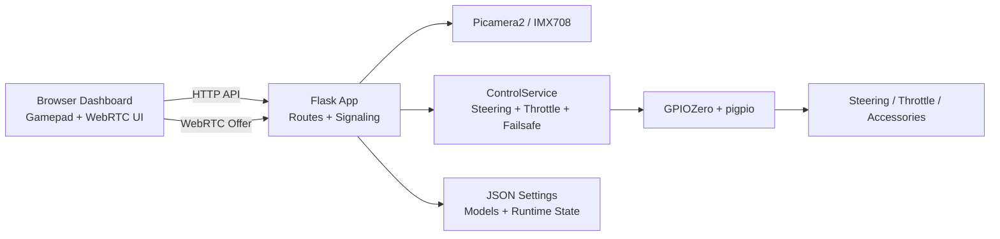
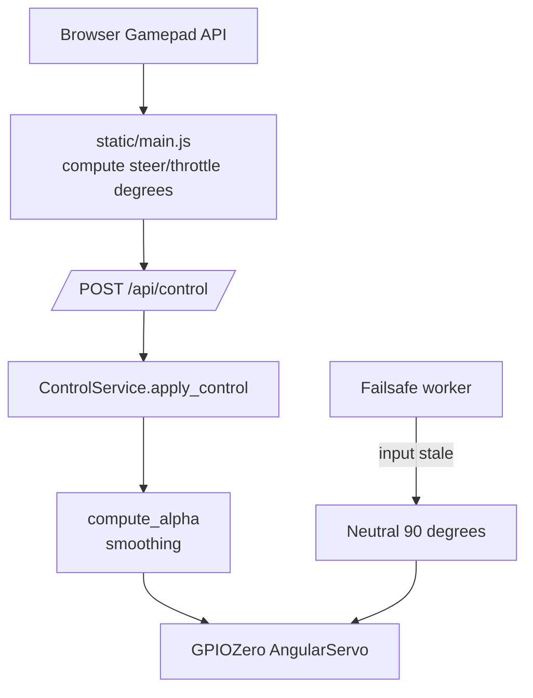

# FPV Ultimate

FPV Ultimate is a Raspberry Pi based FPV remote-control vehicle platform with a browser dashboard, WebRTC video, Picamera2 camera support, GPIOZero servo control, model profiles, accessory outputs, and failsafe behavior.

This is a real hardware project. It is designed around live camera video, browser gamepad input, steering/throttle PWM output, accessory control, and safe recovery when control input stops.

## Dashboard


The dashboard provides live video controls, gamepad connection state, failsafe status, FPS/ping feedback, camera settings, model profiles, trims, rates, reversing, transmission control, and lights control.

## Current Status

| Area | Status |
|---|---|
| Raspberry Pi runtime | Working under `systemd` |
| Camera/video | Picamera2 + WebRTC running on Pi hardware |
| Control output | Steering/throttle PWM through GPIOZero + pigpio |
| Failsafe | Neutral return when input stops |
| Settings/models | JSON-backed runtime configuration |
| Accessories | Transmission and lights PWM outputs |
| CI | GitHub Actions syntax checks for Python and browser JavaScript |
| Known controller issue | DS4Windows/HidHide can interfere with browser gamepad input |

Known-good tags are kept throughout the refactor history, including:

```text
stable-rpi-systemd-baseline
stable-modular-refactor-1
stable-modular-refactor-2
stable-modular-refactor-3
stable-settings-model-routes
stable-accessory-routes
stable-control-failsafe-service
```

## System Overview



More detailed architecture diagrams are in [docs/architecture.md](docs/architecture.md).

## Features

### Video

- WebRTC browser video stream
- Raspberry Pi Camera / IMX708 support through Picamera2/libcamera
- Runtime video resolution, FPS, color-order, and flip settings
- Fullscreen dashboard video mode
- Browser-side recording support

### Control

- Browser Gamepad API input
- PS5 DualSense/native browser control support
- Steering servo output
- Throttle/ESC servo output
- Adjustable trim, rate, reversing, and smoothing
- Model profile storage for vehicle presets

### Safety

- Backend failsafe thread
- Control timeout returns steering/throttle to neutral
- Runtime failsafe enable/disable setting
- Bench-test workflow documented before vehicle testing

### Accessories

- Transmission low/high PWM accessory output
- Lights on/off PWM accessory output
- Accessory state exposed through API and dashboard controls

## Hardware Overview

Current build target:

| Component | Purpose |
|---|---|
| Raspberry Pi 4 | Main FPV/control computer |
| Raspberry Pi Camera / IMX708 | Live video source |
| GPIOZero + pigpio | Servo PWM control backend |
| Steering servo | Steering output |
| ESC/throttle servo signal | Throttle/brake/reverse output |
| Accessory PWM outputs | Transmission and lights |
| PS5 DualSense or compatible gamepad | Browser-based control |
| Buck converter/BEC | External servo/accessory power |

## Wiring

Detailed wiring, buck converter, PWM signal, and common-ground instructions are available in [docs/wiring.md](docs/wiring.md).

### GPIO Pin Mapping

| Function | Raspberry Pi GPIO | Physical Pin | Signal Type | Notes |
|---|---:|---:|---|---|
| Steering servo | GPIO12 | Pin 32 | PWM servo signal | Main steering output |
| Throttle / ESC | GPIO13 | Pin 33 | PWM servo signal | Throttle / brake / reverse output |
| Transmission accessory | GPIO6 | Pin 31 | PWM servo signal | Low/high toggle output |
| Lights accessory | GPIO21 | Pin 40 | PWM servo signal | Off/on toggle output |
| Ground | GND | Pins 6, 9, 14, 20, 25, 30, 34, or 39 | Ground | Must be common with servo/ESC power |
| Camera | CSI ribbon | Camera connector | CSI camera | Raspberry Pi camera |

Important: do not power multiple servos directly from the Raspberry Pi 5V pin. Use an external BEC or buck converter for servo/accessory power, and tie grounds together.

## Software Architecture

Current structure:

```text
fpv-ultimate/
├── app.py
├── README.md
├── requirements.txt
├── .env.example
├── data/
│   ├── models.json
│   └── settings.json
├── docs/
│   ├── architecture.md
│   ├── controller-troubleshooting.md
│   ├── fpv-ultimate-dashboard.jpeg
│   └── wiring.md
├── fpv_ultimate/
│   ├── __init__.py
│   ├── accessories.py
│   ├── accessory_routes.py
│   ├── control_math.py
│   ├── control_service.py
│   ├── health.py
│   ├── pages.py
│   ├── settings_models_routes.py
│   ├── storage.py
│   ├── system_actions.py
│   └── video_config.py
├── scripts/
│   └── install_pi.sh
├── static/
│   └── main.js
├── systemd/
│   └── fpv-ultimate.service.reference
└── templates/
    └── index.html
```

### Backend Modules

| File | Purpose |
|---|---|
| `app.py` | Flask app assembly, camera/WebRTC setup, service startup/shutdown |
| `fpv_ultimate/accessories.py` | Transmission/lights servo helper |
| `fpv_ultimate/accessory_routes.py` | Accessory API route registration |
| `fpv_ultimate/control_math.py` | Control smoothing and clamp helpers |
| `fpv_ultimate/control_service.py` | Steering/throttle output state and failsafe behavior |
| `fpv_ultimate/health.py` | Health-check response helper |
| `fpv_ultimate/pages.py` | Dashboard page/template helper |
| `fpv_ultimate/settings_models_routes.py` | Settings/model API route registration |
| `fpv_ultimate/storage.py` | JSON settings/model persistence |
| `fpv_ultimate/system_actions.py` | System actions such as reboot requests |
| `fpv_ultimate/video_config.py` | Video resolution and FPS helpers |

### API Overview

| Route | Method | Purpose |
|---|---|---|
| `/` | GET | Main browser dashboard |
| `/ping` | GET | Health check |
| `/offer` | POST | WebRTC offer/answer negotiation |
| `/api/control` | POST | Steering/throttle servo command |
| `/api/transmission` | POST | Set/toggle transmission accessory |
| `/api/lights` | POST | Set/toggle lights accessory |
| `/api/accessories` | GET | Read accessory state |
| `/api/settings` | GET/POST | Read/update runtime settings |
| `/api/models` | GET | List model profiles |
| `/api/models/save` | POST | Save model profile |
| `/api/models/delete` | POST | Delete/reset model profile |
| `/api/models/rename` | POST | Rename model profile |
| `/api/reboot` | POST | Reboot Raspberry Pi |

## Control and Failsafe Flow



## Runtime Data

Runtime data is stored in:

```text
data/settings.json
data/models.json
```

These files currently act as starter/default configuration. If the project is used across multiple vehicles, these can later be converted into `.example.json` files with real runtime files ignored by Git.

## Environment Variables

Example values are shown in `.env.example`:

| Variable | Purpose | Default |
|---|---|---|
| `FPV_HOST` | Flask bind host | `127.0.0.1` |
| `FPV_PORT` | Flask bind port | `5000` |
| `FPV_DATA_DIR` | Runtime data folder | `data` |

The systemd reference also preserves audio-related environment variables:

```text
FPV_AUDIO_IN
FPV_AUDIO_OUT
```

These may be used by future audio features.

## Installation on Raspberry Pi OS

A repeatable Pi setup helper is available at:

```bash
scripts/install_pi.sh
```

Manual setup:

```bash
sudo apt update
sudo apt install -y \
  python3-venv \
  python3-pip \
  python3-libcamera \
  python3-picamera2 \
  python3-kms++ \
  python3-prctl \
  libcamera-apps \
  pigpio \
  python3-pigpio
```

Enable pigpio:

```bash
sudo systemctl enable --now pigpiod
```

Clone and set up the app:

```bash
cd ~
git clone git@github.com:Echo13091/fpv-ultimate.git
cd fpv-ultimate
python3 -m venv --system-site-packages .venv
source .venv/bin/activate
pip install -r requirements.txt
```

The `--system-site-packages` flag is important because Raspberry Pi camera packages such as `libcamera` and `picamera2` are commonly installed through Raspberry Pi OS packages.

## Running the App

### systemd

The live service is installed at:

```text
/etc/systemd/system/fpv-ultimate.service
```

A reference copy is stored in:

```text
systemd/fpv-ultimate.service.reference
```

Common commands:

```bash
sudo systemctl restart fpv-ultimate
systemctl status fpv-ultimate --no-pager -l
sudo journalctl -u fpv-ultimate -n 80 --no-pager -l
```

### Manual Run

Stop the service first because only one process can own the camera at a time:

```bash
sudo systemctl stop fpv-ultimate
cd ~/fpv-ultimate
source .venv/bin/activate
python app.py
```

Then open:

```text
http://127.0.0.1:5000
```

Restart service after manual testing:

```bash
sudo systemctl start fpv-ultimate
```

## Testing and CI

GitHub Actions currently runs lightweight syntax checks:

```text
python -m py_compile app.py fpv_ultimate/*.py
node --check static/main.js
```

Full runtime tests are done on the Raspberry Pi because camera, GPIO, pigpio, and libcamera are hardware-specific.

Recommended Pi-side smoke checks:

```bash
python -m py_compile app.py fpv_ultimate/*.py
curl -s http://127.0.0.1:5000/ping
curl -s http://127.0.0.1:5000/api/settings | python3 -m json.tool
curl -s http://127.0.0.1:5000/api/models | python3 -m json.tool
curl -s http://127.0.0.1:5000/api/accessories | python3 -m json.tool
curl -s -X POST http://127.0.0.1:5000/api/control \
  -H "Content-Type: application/json" \
  -d '{"steer":90,"throttle":90}' | python3 -m json.tool
```

## Safety Notes

This project controls real moving hardware.

Before bench testing:

1. Put the vehicle on a stand.
2. Keep wheels off the ground.
3. Confirm steering direction.
4. Confirm throttle neutral.
5. Confirm failsafe behavior.
6. Confirm browser disconnect returns throttle to neutral.
7. Confirm accessory outputs do not bind mechanical parts.

Failsafe timeout is currently:

```text
0.25 seconds
```

If browser/gamepad control stops updating, steering and throttle return to neutral.

## Troubleshooting

### Controller connected but no steering/throttle

See [docs/controller-troubleshooting.md](docs/controller-troubleshooting.md).

DS4Windows, HidHide, Steam Input, and virtual controller drivers can interfere with browser Gamepad API input. If the dashboard shows a connected controller but steering/throttle stay neutral, disable DS4Windows/HidHide or make sure the browser sees only one clean controller device.

### Camera busy

If manual testing fails with:

```text
Device or resource busy
Pipeline handler in use by another process
```

then the systemd service or another camera process already owns the camera.

Find camera users:

```bash
sudo fuser -v /dev/media* /dev/video* 2>/dev/null
```

### Missing libcamera

If you see:

```text
ModuleNotFoundError: No module named 'libcamera'
```

install the Raspberry Pi OS camera packages and recreate the venv with system site packages:

```bash
sudo apt install -y python3-libcamera python3-picamera2
python3 -m venv --system-site-packages .venv
```

### pigpio / GPIO issues

Check pigpio:

```bash
systemctl status pigpiod --no-pager -l
```

Start it:

```bash
sudo systemctl enable --now pigpiod
```

## Development Workflow

Normal update flow on the Pi:

```bash
cd ~/fpv-ultimate
git pull
sudo systemctl restart fpv-ultimate
sudo journalctl -u fpv-ultimate -n 80 --no-pager -l
```

Before changes:

```bash
git status
```

After changes:

```bash
python -m py_compile app.py fpv_ultimate/*.py
git diff --stat
git status
```

After testing:

```bash
git add .
git commit -m "Describe the change"
git push
```

## Roadmap

Potential next improvements:

- Add `scripts/smoke_test.sh` for Pi-side endpoint testing.
- Extract camera/WebRTC lifecycle into dedicated modules.
- Split the large browser client (`static/main.js`) into smaller frontend modules.
- Add deployment/testing docs under `docs/`.
- Convert runtime JSON files into example templates if multiple vehicle profiles are needed.

## License

No license has been selected yet.
