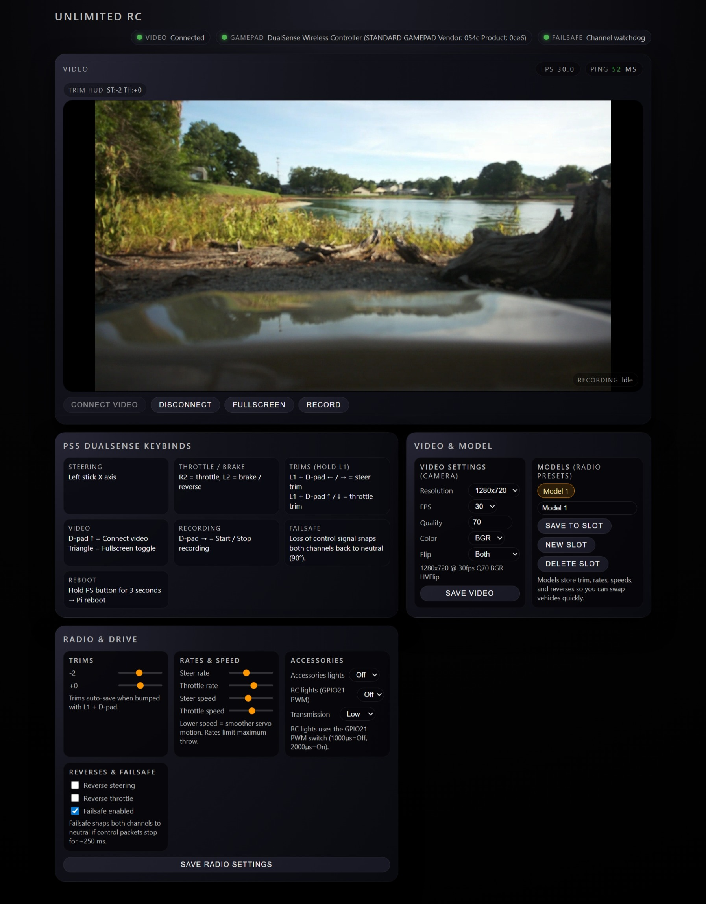

# FPV Ultimate

FPV Ultimate is a Raspberry Pi based FPV remote-control vehicle platform using a Flask web interface, WebRTC video streaming, Picamera2, GPIOZero servo control, and browser gamepad input.

The project is designed for real hardware: Raspberry Pi camera video, steering/throttle servo control, accessory servo outputs, browser-based control, and failsafe behavior for RC/FPV experiments.

## Dashboard



The dashboard provides WebRTC video controls, gamepad connection state, failsafe status, FPS/ping feedback, camera settings, model profiles, trims, rates, reversing, and accessory controls.

## Current Status

This repository started as a working Raspberry Pi project and is being refactored into a cleaner modular structure.

Current working state:

- Runs on Raspberry Pi OS
- Runs under `systemd`
- Streams Raspberry Pi camera video through WebRTC
- Uses GPIOZero + pigpio for servo control
- Supports browser gamepad control
- Uses JSON files for settings and model profiles
- Includes failsafe neutral return when control input stops
- Includes transmission and lights accessory outputs

Known-good tag:

```text
stable-rpi-systemd-baseline
```

## Features

- Low-latency browser video using WebRTC
- Raspberry Pi Camera Module support through Picamera2/libcamera
- Steering servo control
- Throttle/ESC servo control
- Browser-based PS5 DualSense/gamepad input
- Adjustable steering and throttle trims
- Adjustable steering and throttle rates
- Adjustable steering and throttle smoothing/speed
- Steering/throttle channel reversing
- Failsafe neutral return when control input stops
- Servo-based accessory output for transmission high/low
- Servo-based accessory output for lights on/off
- Model profile storage
- Runtime settings storage
- systemd deployment support

## Hardware Overview

The current build uses:

- Raspberry Pi 4
- Raspberry Pi Camera Module / IMX708 camera
- Servo or ESC for steering/throttle
- GPIOZero with pigpio backend
- Browser client for video/control
- PS5 DualSense or compatible browser gamepad

## Wiring

Detailed wiring, buck converter, common ground, and PWM signal instructions are available in [docs/wiring.md](docs/wiring.md).

### GPIO Pin Mapping

| Function | Raspberry Pi GPIO | Physical Pin | Signal Type | Notes |
|---|---:|---:|---|---|
| Steering servo | GPIO12 | Pin 32 | PWM servo signal | Main steering output |
| Throttle / ESC servo | GPIO13 | Pin 33 | PWM servo signal | Throttle / brake / reverse output |
| Transmission accessory | GPIO6 | Pin 31 | PWM servo signal | Low/high toggle output |
| Lights accessory | GPIO21 | Pin 40 | PWM servo signal | Off/on toggle output |
| Ground | GND | Pins 6, 9, 14, 20, 25, 30, 34, or 39 | Ground | Must be common with servo/ESC power |
| Camera | CSI ribbon | Camera connector | CSI camera | IMX708 / Pi camera |

### Servo Signal Wiring

Each servo-style output needs:

```text
Raspberry Pi GPIO signal  -> servo signal wire
External 5V/6V power      -> servo power wire
External power ground     -> servo ground wire
Raspberry Pi ground       -> external power ground
```

Important: the Raspberry Pi should usually **not** power multiple servos directly from its 5V pin. Use an external BEC/servo power supply for servos and ESCs.

### Common Ground Requirement

The Raspberry Pi and servo/ESC power supply must share ground.

```text
Pi GND -------------- External servo/BEC GND
GPIO signal --------- Servo signal
BEC +5V/+6V --------- Servo V+
BEC GND ------------- Servo GND
```

If grounds are not common, the servo signal may behave unpredictably.

## Current Servo Configuration

The app currently creates the servo outputs with these pulse ranges:

### Steering Servo

```text
GPIO: GPIO12
Angle range: 0° to 180°
Pulse width: 500 µs to 2500 µs
Neutral: 90°
```

### Throttle / ESC Servo

```text
GPIO: GPIO13
Angle range: 0° to 180°
Pulse width: 500 µs to 2500 µs
Neutral: 90°
```

### Transmission Accessory

```text
GPIO: GPIO6
Angle range: 0° to 180°
Pulse width: 1000 µs to 2000 µs
Default low angle: 0°
Default high angle: 180°
```

### Lights Accessory

```text
GPIO: GPIO21
Angle range: 0° to 180°
Pulse width: 1000 µs to 2000 µs
Default off angle: 0°
Default on angle: 180°
```

## Safety Notes

This project controls real moving hardware.

Before testing on a vehicle:

1. Put the vehicle on a stand.
2. Keep wheels off the ground.
3. Confirm steering direction.
4. Confirm throttle neutral.
5. Confirm failsafe behavior.
6. Confirm browser disconnect returns throttle to neutral.
7. Confirm accessory outputs do not bind mechanical parts.

The app includes a failsafe thread that returns steering and throttle to neutral if control input stops.

Current failsafe timeout:

```text
0.25 seconds
```

That means if browser/gamepad control stops updating, steering and throttle are returned to neutral.

## Software Architecture

Current structure:

```text
fpv-ultimate/
├── app.py
├── README.md
├── requirements.txt
├── .env.example
├── data/
│   ├── models.json
│   └── settings.json
├── docs/
├── fpv_ultimate/
│   ├── __init__.py
│   ├── accessories.py
│   ├── accessory_routes.py
│   ├── control_math.py
│   ├── control_service.py
│   ├── health.py
│   ├── pages.py
│   ├── settings_models_routes.py
│   ├── storage.py
│   ├── system_actions.py
│   └── video_config.py
├── static/
│   └── main.js
├── systemd/
│   └── fpv-ultimate.service.reference
└── templates/
    └── index.html
```

### Important Files

| File | Purpose |
|---|---|
| `app.py` | Main Flask app, WebRTC camera handling, GPIO startup, routes, lifecycle |
| `fpv_ultimate/storage.py` | Settings/model JSON loading and saving |
| `fpv_ultimate/control_math.py` | Control smoothing helper |
| `fpv_ultimate/control_service.py` | Steering/throttle output state and failsafe behavior |
| `fpv_ultimate/accessories.py` | Transmission/lights accessory servo helper |
| `fpv_ultimate/accessory_routes.py` | Accessory API route registration for lights/transmission state |
| `fpv_ultimate/health.py` | Health-check response helper |
| `fpv_ultimate/pages.py` | Dashboard page/template helper |
| `fpv_ultimate/settings_models_routes.py` | Settings and model-profile API route registration |
| `fpv_ultimate/system_actions.py` | System-level helpers such as reboot requests |
| `fpv_ultimate/video_config.py` | Video resolution and FPS helper logic |
| `static/main.js` | Browser/gamepad control logic |
| `templates/index.html` | Browser UI |
| `data/settings.json` | Runtime settings |
| `data/models.json` | Model profiles |
| `systemd/fpv-ultimate.service.reference` | Reference copy of working systemd config |

## Runtime Data

Runtime data is stored in:

```text
data/settings.json
data/models.json
```

These are currently committed as starter/default configuration files.

Later, they may be changed to:

```text
data/settings.example.json
data/models.example.json
```

with real runtime files ignored by Git.

## Environment Variables

Example values are shown in `.env.example`:

```text
FPV_HOST=127.0.0.1
FPV_PORT=5000
FPV_DATA_DIR=data
```

| Variable | Purpose | Default |
|---|---|---|
| `FPV_HOST` | Flask bind host | `127.0.0.1` |
| `FPV_PORT` | Flask bind port | `5000` |
| `FPV_DATA_DIR` | Runtime data folder | `data` |

The systemd service may also define audio-related values:

```text
FPV_AUDIO_IN
FPV_AUDIO_OUT
```

These are preserved in the service reference, but may not be used by the current app code yet.

## Installation on Raspberry Pi OS

A repeatable Raspberry Pi setup helper is available at `scripts/install_pi.sh`.

Install system packages:

```bash
sudo apt update
sudo apt install -y \
  python3-venv \
  python3-pip \
  python3-libcamera \
  python3-picamera2 \
  python3-kms++ \
  python3-prctl \
  libcamera-apps \
  pigpio \
  python3-pigpio
```

Enable pigpio daemon:

```bash
sudo systemctl enable --now pigpiod
```

Clone the repo:

```bash
cd ~
git clone git@github.com:Echo13091/fpv-ultimate.git
cd fpv-ultimate
```

Create a virtual environment that can see Raspberry Pi system packages:

```bash
python3 -m venv --system-site-packages .venv
source .venv/bin/activate
pip install -r requirements.txt
```

## Run Manually

Stop the systemd service first if it is running, because only one process can own the camera at a time:

```bash
sudo systemctl stop fpv-ultimate
```

Run manually:

```bash
cd ~/fpv-ultimate
source .venv/bin/activate
python app.py
```

Open:

```text
http://127.0.0.1:5000
```

Stop with:

```text
Ctrl+C
```

Restart service:

```bash
sudo systemctl start fpv-ultimate
```

## systemd Deployment

The live service file is installed at:

```text
/etc/systemd/system/fpv-ultimate.service
```

The repo includes a reference copy at:

```text
systemd/fpv-ultimate.service.reference
```

Current service behavior:

```text
WorkingDirectory=/home/rc2/fpv-ultimate
ExecStart=/home/rc2/fpv-ultimate/.venv/bin/python app.py
Restart=always
User=rc2
```

Check status:

```bash
systemctl status fpv-ultimate --no-pager -l
```

View logs:

```bash
sudo journalctl -u fpv-ultimate -n 80 --no-pager -l
```

Restart:

```bash
sudo systemctl restart fpv-ultimate
```

## API Overview

| Route | Method | Purpose |
|---|---|---|
| `/` | GET | Main browser control UI |
| `/ping` | GET | Health check |
| `/offer` | POST | WebRTC offer/answer negotiation |
| `/api/control` | POST | Steering/throttle servo command |
| `/api/transmission` | POST | Toggle or set transmission accessory |
| `/api/lights` | POST | Toggle or set lights accessory |
| `/api/accessories` | GET | Read accessory states |
| `/api/settings` | GET/POST | Read/update runtime settings |
| `/api/models` | GET | List model profiles |
| `/api/models/save` | POST | Save model profile |
| `/api/models/delete` | POST | Delete/reset model profile |
| `/api/models/rename` | POST | Rename model profile |
| `/api/reboot` | POST | Reboot Raspberry Pi |

## WebRTC / Camera Notes

The app uses:

- `Picamera2`
- `libcamera`
- `aiortc`
- `PyAV`

The camera is configured from runtime settings:

```text
video_resolution
video_fps
video_flip
video_color_order
```

Supported resolutions:

```text
640x360
1280x720
1920x1080
```

Only one process can access the Pi camera at a time. If manual testing fails with:

```text
Device or resource busy
Pipeline handler in use by another process
```

then the systemd service or another camera process is already using the camera.

Find camera users:

```bash
sudo fuser -v /dev/media* /dev/video* 2>/dev/null
```

## Development Workflow

Normal update flow on the Pi:

```bash
cd ~/fpv-ultimate
git pull
sudo systemctl restart fpv-ultimate
sudo journalctl -u fpv-ultimate -n 80 --no-pager -l
```

Before making changes:

```bash
git status
```

After making changes:

```bash
python -m py_compile app.py fpv_ultimate/*.py
git diff --stat
git status
```

Commit:

```bash
git add .
git commit -m "Describe the change"
```

Test service:

```bash
sudo systemctl restart fpv-ultimate
sleep 3
systemctl status fpv-ultimate --no-pager -l
sudo journalctl -u fpv-ultimate -n 80 --no-pager -l
```

Push:

```bash
git push
```

## Known Good Rollback

A known-good tag exists:

```text
stable-rpi-systemd-baseline
```

To temporarily roll back:

```bash
cd ~/fpv-ultimate
git checkout stable-rpi-systemd-baseline
sudo systemctl restart fpv-ultimate
```

To return to main:

```bash
git checkout main
git pull
sudo systemctl restart fpv-ultimate
```

## Refactor Status

Completed:

- Imported working Raspberry Pi project
- Added GitHub repo
- Added `.gitignore`
- Added `.env.example`
- Added `requirements.txt`
- Added detailed README
- Moved runtime JSON into `data/`
- Added systemd service reference
- Extracted settings/model storage helpers
- Extracted control smoothing helper
- Extracted accessory servo helper

Planned:

- Separate Flask route groups
- Separate GPIO/servo setup
- Separate camera/WebRTC lifecycle
- Add safer startup checks
- Add better install script
- Add wiring diagram image
- Add systemd install script
- Add optional Tailscale Serve notes

## Troubleshooting

### Camera busy

Error:

```text
RuntimeError: Failed to acquire camera: Device or resource busy
```

Cause:

Another process already owns the camera.

Fix:

```bash
systemctl status fpv-ultimate --no-pager -l
sudo fuser -v /dev/media* /dev/video* 2>/dev/null
```

Stop service before manual testing:

```bash
sudo systemctl stop fpv-ultimate
```

### Missing libcamera

Error:

```text
ModuleNotFoundError: No module named 'libcamera'
```

Cause:

The venv cannot see Raspberry Pi OS camera packages.

Fix:

```bash
sudo apt install -y python3-libcamera python3-picamera2
python3 -m venv --system-site-packages .venv
```

### pigpio / GPIO errors

Check pigpio:

```bash
systemctl status pigpiod --no-pager -l
```

Start it:

```bash
sudo systemctl enable --now pigpiod
```

### Service logs

```bash
sudo journalctl -u fpv-ultimate -n 100 --no-pager -l
```

## License

No license has been selected yet.
