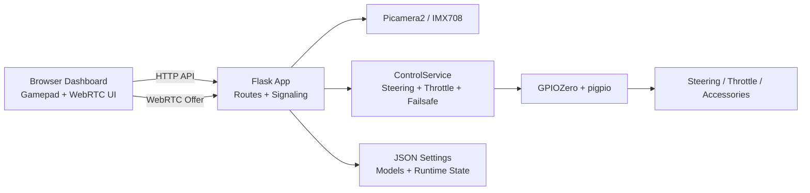
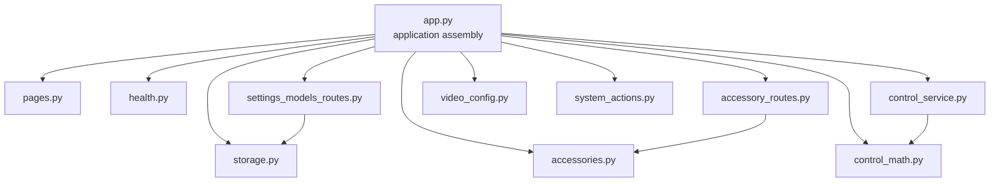
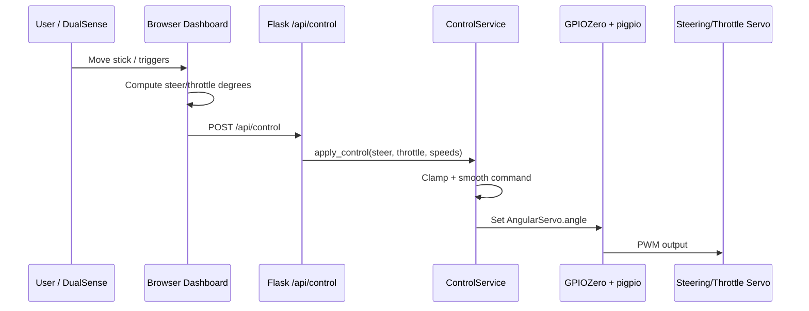
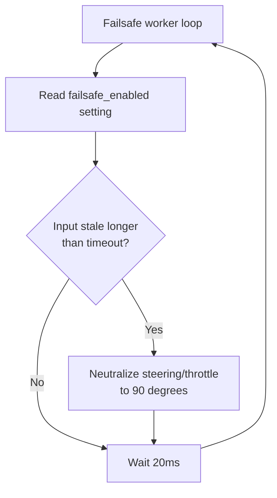
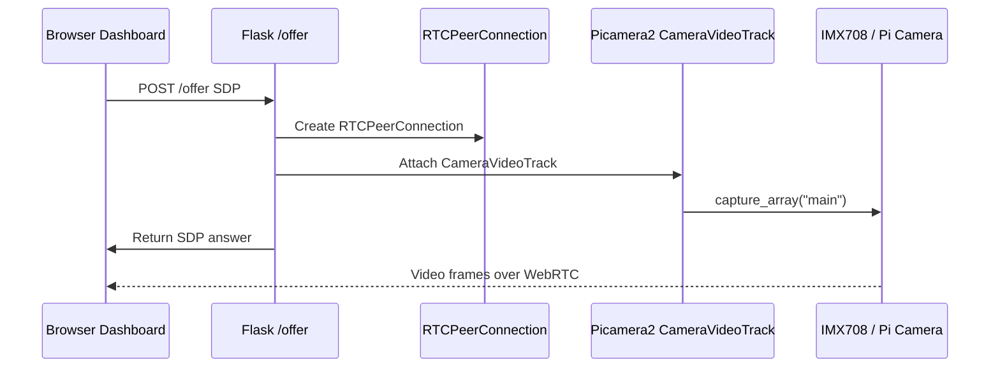
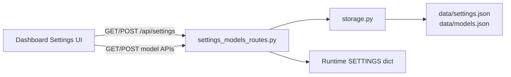
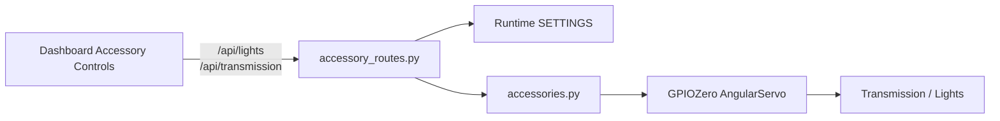

# FPV Ultimate Architecture

This document expands the system diagrams from the README and explains how the browser dashboard, Flask backend, WebRTC camera path, JSON persistence, GPIO output, and failsafe behavior fit together.

## System Overview



## Backend Module Layout



## Browser Control Flow



## Failsafe Flow



The failsafe worker does not depend on the browser. It uses backend state inside `ControlService` and returns outputs to neutral if control input stops updating.

## WebRTC Video Flow



## Settings and Model Flow



## Accessory Flow



## Runtime Boundary

GitHub Actions checks syntax only. Hardware-backed runtime behavior is tested on the Raspberry Pi because the following dependencies are Pi-specific:

- `libcamera`
- `Picamera2`
- GPIO hardware access
- `pigpio`
- physical servo/ESC behavior

Recommended Pi-side validation after meaningful changes:

```bash
python -m py_compile app.py fpv_ultimate/*.py
curl -s http://127.0.0.1:5000/ping
curl -s http://127.0.0.1:5000/api/settings | python3 -m json.tool
curl -s http://127.0.0.1:5000/api/models | python3 -m json.tool
curl -s http://127.0.0.1:5000/api/accessories | python3 -m json.tool
curl -s -X POST http://127.0.0.1:5000/api/control \
  -H "Content-Type: application/json" \
  -d '{"steer":90,"throttle":90}' | python3 -m json.tool
```
